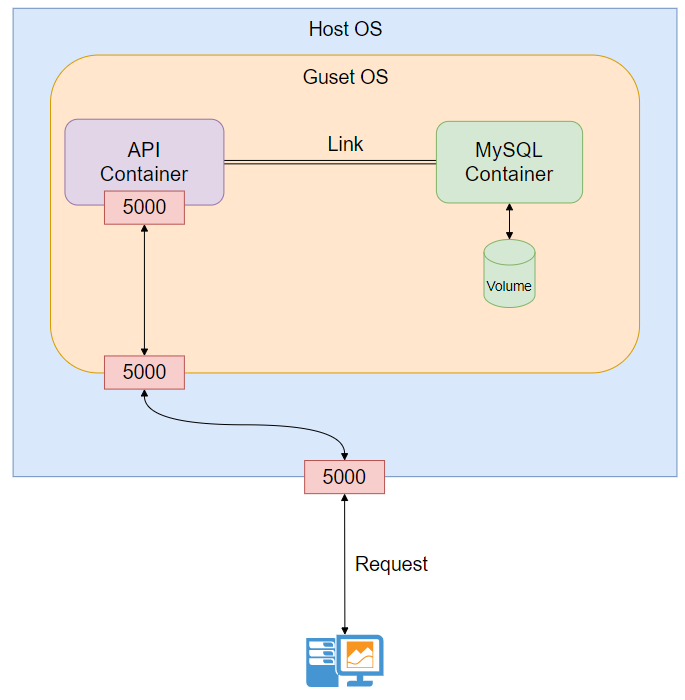
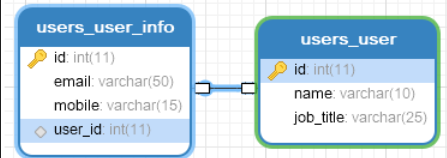

# Documentation

- [Documentation](#documentation)
  - [Introduction](#introduction)
  - [Architecture](#architecture)
  - [Project Structure](#project-structure)
  - [Table Schema And Entity-relationship Model](#table-schema-and-entity-relationship-model)
  - [API Documentation](#api-documentation)
    - [Overview](#overview)
    - [Detail](#detail)
      - [查詢所有用戶資訊](#查詢所有用戶資訊)
        - [Example](#example)
        - [Introduction](#introduction-1)
        - [Success Status](#success-status)
        - [Success Response Body](#success-response-body)
      - [查詢單一用戶資訊](#查詢單一用戶資訊)
        - [Example](#example-1)
        - [Introduction](#introduction-2)
        - [Success Status](#success-status-1)
          - [Success Response Body](#success-response-body-1)
      - [新增用戶](#新增用戶)
        - [Example](#example-2)
        - [Introduction](#introduction-3)
        - [Success Status](#success-status-2)
          - [Success Response Body](#success-response-body-2)
      - [修改用戶資訊](#修改用戶資訊)
        - [Example](#example-3)
        - [Introduction](#introduction-4)
        - [Success Status](#success-status-3)
          - [Success Response Body](#success-response-body-3)
      - [刪除用戶資訊](#刪除用戶資訊)
        - [Example](#example-4)
        - [Introduction](#introduction-5)
        - [Success Status](#success-status-4)
          - [Success Response Body](#success-response-body-4)


## Introduction
此Demo項目使用Flask完成 


---

## Architecture



---
## Project Structure
```
.
├── app
├── db.env
├── docker-compose.yaml
├── Dockerfile
├── mysql_config
```

檔案用途說明
* `db.env` : 將常用變數獨立出docker-compose文件。
* `Dockerfile` : 用於Flask項目Image Build。
* `docker-compose.yaml` : docker-compose編排文件，整合Flask項目容器以及MySQL容器。
* `mysql_config/my.cnf` : 容器內部透過掛載外部MYSQL配置檔案，進行預設Character-Set設置。
* `sql-script/*.sql` : 用於MySQL容器初始化時建立用戶以及相關Table。 
補充說明
* `/data` : 掛載Guest_OS的/data目錄避免資料庫容器異常時數據遺失，進行數據持久化。

---
## Table Schema And Entity-relationship Model




---

## API Documentation

### Overview

| Support Method | URI               | Description      |
| -------------- |:----------------- |:---------------- |
| GET            | api/v1/users/\<id> | 查詢單一用戶資訊    |
| GET            | api/v1/users/     | 查詢所有用戶資訊    |
| POST           | api/v1/users/     | 新增用戶資訊       |
| PUT            | api/v1/users/\<id> | 修改用戶資訊       |
| DELETE         | api/v1/users/\<id> | 刪除用戶資訊       |

---

### Detail

#### 查詢所有用戶資訊

##### Example 
    curl -X GET http://domain:5000/api/v1/users/

##### Introduction
    Method: GET
    
    URI: /api/v1/users/
    
    
##### Success Status
    Code : 200 OK
  
  
##### Success Response Body
    [
        {
            "id": 1,
            "name": "Charles111",
            "job_title": "SRE",
            "communicate_information": {
                "email": "charles@gmail.com",
                "mobile": "09xx-xxx-xxx"
            }
        },
        {
            "id": 2,
            "name": "Charles111",
            "job_title": "SRE",
            "communicate_information": {
                "email": "charles@gmail.com",
                "mobile": "09xx-xxx-xxx"
            }
        },
        {
            "id": 3,
            "name": "Spencer",
            "job_title": "Devops",
            "communicate_information": {
                "email": "Spencer810704@gmail.com",
                "mobile": "0977330615"
            }
        },
        {
            "id": 4,
            "name": "Spencer",
            "job_title": "Devops",
            "communicate_information": {
                "email": "Spencer810704@gmail.com",
                "mobile": "0977330615"
            }
        }
    ]
        
---

#### 查詢單一用戶資訊

##### Example
    curl -X GET http://domain:5000/api/v1/users/1/

##### Introduction
    Method: GET
    
    URI: /api/v1/users/<id>/
    


##### Success Status
    Code : 200 OK


###### Success Response Body
    {
        "id": 1,
        "name": "Charles111",
        "job_title": "SRE",
        "communicate_information": {
            "email": "charles@gmail.com",
            "mobile": "09xx-xxx-xxx"
        }
    }    


        

---

#### 新增用戶

##### Example
    curl -X POST http://domain:5000/api/v1/users/ \
            -H 'content-type: application/json' \
            -d '{"name": "ABC","job_title": "Devops","communicate_information": {"email": "AAA@gmail.com","mobile": "11564654"}}'
    
##### Introduction
    Method: POST
    
    URI: /api/v1/users/
    


##### Success Status
    Code : 200 OK


###### Success Response Body
    {
        "id": 5,
        "name": "ABC",
        "job_title": "Devops",
        "communicate_information": {
            "email": "AAA@gmail.com",
            "mobile": "11564654"
        }
    }    


        
---

#### 修改用戶資訊

##### Example
    curl -X PUT http://domain:5000/api/v1/users/2/ \
          -H 'content-type: application/json' \
          -d '{"name": "ales111","job_title": "devops","communicate_information": {"email": "charles@gmail.com","mobile": "01111111"}}'


##### Introduction
    Method: PUT
    
    URI: /api/v1/users/<id>/
    


##### Success Status
    Code : 200 OK


###### Success Response Body
    {
        "id": 2,
        "name": "ales111",
        "job_title": "devops",
        "communicate_information": {
            "email": "charles@gmail.com",
            "mobile": "01111111"
        }
    }


---

#### 刪除用戶資訊

##### Example
    curl -X DELETE http://domain:5000/api/v1/users/1/
    

##### Introduction
    Method: DELETE
    
    URI: /api/v1/users/<id>/
    


##### Success Status
    Code : 200 OK


###### Success Response Body  
    {
        "status": "delete success!"
    }

        
---

